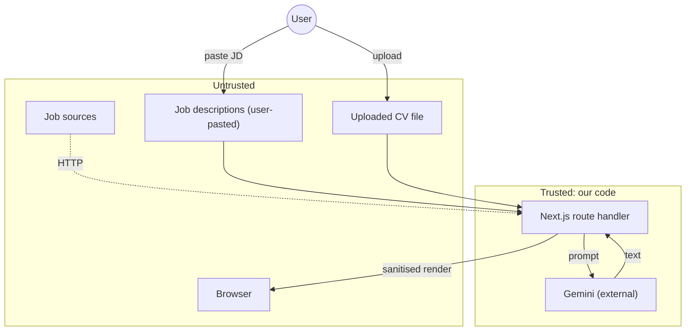
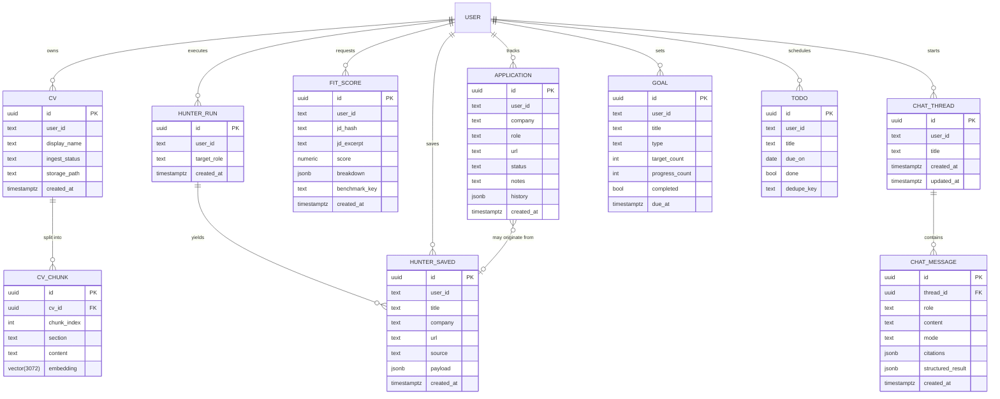
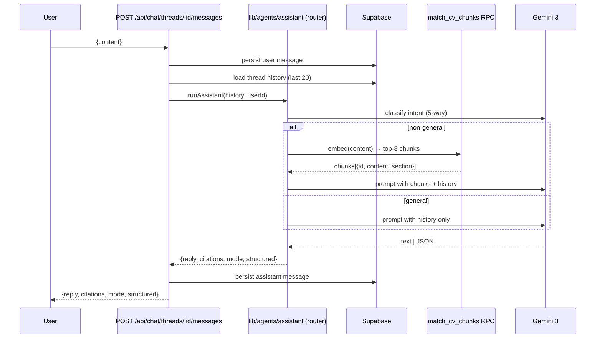
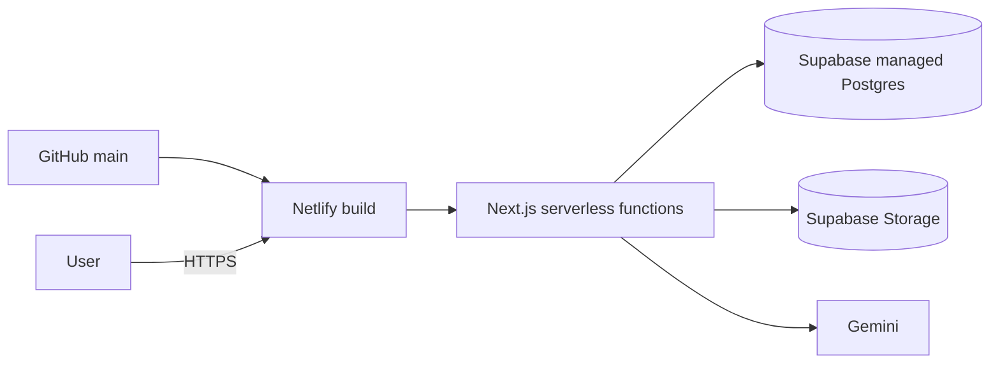

# CareerPilot — System Design

> **Audience.** Hackathon judges, future maintainers, and the next dev who gets paged at 03:00.
> **Scope.** The production system, not the prototype. Backed by the code in `app/`, `lib/`, and `supabase/migrations/`.

---

## 1. Goals & non-goals

### Goals
1. **CV is the single source of truth.** Every AI surface (Hunter prompt, Assistant, Fit-score) is grounded in the user's own CV vectors. No generic LLM priors.
2. **Single user, single deploy, multi-pillar.** One Next.js app, one Supabase project, one auth provider.
3. **Auditable, repairable AI outputs.** Fit-score is programmatic (weighted formula). Assistant responses carry citations and a structured payload.
4. **Cheap to run.** Target < **\$0.10 / active user / month** at 1k MAU.

### Non-goals
- Background job system (CV ingest is synchronous; reasoning in §6).
- Mobile-native client.
- Multi-tenant SaaS billing.
- Long-term CV diff/history (last-write-wins on display name only).
- Internationalisation (English only for the hackathon).

---

## 2. Architecture overview

### 2.1 Request flow

```mermaid
flowchart LR
  subgraph Browser
    UI[Next 15 RSC + client components]
  end

  subgraph "Next.js 15 (Netlify)"
    MW[middleware.ts: Clerk protect]
    Pages[app/(dashboard)/* pages]
    API[app/api/* route handlers]
    Agents[lib/agents/*<br/>hunter · assistant · fitScore]
    AI[lib/ai/provider.ts<br/>+ resilience.ts]
    Auth[lib/auth/require-user.ts]
    SBadmin[lib/supabase/admin.ts]
    SBserver[lib/supabase/server.ts]
  end

  subgraph "Supabase"
    PG[(Postgres 15 + pgvector)]
    Storage[(Storage: cvs bucket)]
    RLS[RLS deny-all + service-role inserts]
  end

  subgraph "External"
    Gemini[Gemini 3 Flash/Pro + Embedding 2]
    Adzuna
    Arbeitnow
    RemoteOK
    TheMuse
    Tavily
  end

  UI -->|cookie session| MW
  MW --> Pages
  MW --> API
  Pages --> Agents
  API --> Auth
  Auth --> SBserver
  API --> Agents
  Agents --> AI
  AI --> Gemini
  Agents --> SBadmin
  SBadmin --> PG
  SBadmin --> Storage
  Pages --> PG
  Pages --> SBserver
  Agents -.fan-out (4 adapters).-> Adzuna
  Agents -.fan-out (4 adapters).-> Arbeitnow
  Agents -.fan-out (4 adapters).-> RemoteOK
  Agents -.fan-out (4 adapters).-> TheMuse
  Agents -.web search (inline in hunter.ts).-> Tavily
  PG --- RLS
```

### 2.2 Component map

| Layer | Files | Responsibility |
|---|---|---|
| **Routing** | `app/(dashboard)/layout.tsx`, `middleware.ts` | Clerk-gated shell, page-level RSC fetches |
| **Server (RSC)** | `app/(dashboard)/*/page.tsx` | Initial paint + streaming; reads go through `lib/supabase/server.ts` |
| **API** | `app/api/**/route.ts` | Typed JSON in/out; auth via `requireUser()`; no business logic |
| **Agents** | `lib/agents/{hunter,assistant,fitScore}.ts` | Orchestrate multi-source data + LLM |
| **Sources** | `lib/agents/sources/*` (4 adapters) + Tavily inline in `lib/agents/hunter.ts` | Per-vendor adapters, normalised to a `JobCard`; Tavily is a web-search call, not a board adapter |
| **AI** | `lib/ai/{provider,models,embeddings,resilience,parse-json,rate-limit}.ts` | All LLM calls funnel through here; `parse-json.ts` is the robust LLM-JSON extractor used by every sub-agent |
| **CV** | `lib/cv/{parse,chunk}.ts` | PDF/DOCX → plain text → sections |
| **RAG** | `lib/rag/retrieve-cv.ts` | Thin wrapper over the `match_cv_chunks` RPC |
| **Productivity** | `lib/productivity/{types,streak}.ts` | Pure types + streak math |
| **Benchmarks** | `lib/data/benchmarks/*` | Static + dynamic role profiles for fit-score |
| **Auth** | `lib/auth/require-user.ts` | One-call guard, throws 401 `Response` |
| **Supabase** | `lib/supabase/{client,server,admin,middleware}.ts` | 3 client variants (browser / cookie-aware / service-role) |
| **Diagnostics** | `app/api/health/ai/route.ts` | `GET /api/health/ai` → per-model RPD usage (consumed by `evals/run.ts` for preflight) |

### 2.3 Trust boundaries



The LLM is **treated as untrusted output**: all model responses are JSON-validated (assistant modes), HTML-escaped on render, and never used as a primary key.

---

## 3. Data model

### 3.1 Tables



### 3.2 Views

- **`v_weekly_stats(user_id, week_start, apps_sent, todos_done, goals_total, goals_done, roadmap_pct)`** — pure SQL aggregation; powers the dashboard in a single round-trip.

### 3.3 Indexes (selected)

| Index | Why |
|---|---|
| `cv_chunks_embedding_ivf` (pgvector IVF, lists=100) | sub-100ms ANN over 3072-dim vectors at 100k chunks |
| `fit_scores(user_id, jd_hash)` | dedupe repeated JD scoring |
| `applications(user_id, status)` | Kanban GROUP BY status is O(kanban_size) |
| `todos(user_id, due_on)` | Calendar range query |
| `chat_messages(thread_id, created_at)` | history replay |
| `hunter_saved(user_id, url)` unique | idempotent save |

### 3.4 Row-Level Security

All tables follow the same pattern:

```sql
alter table <t> enable row level security;
-- no policies → deny by default
-- writes go through lib/supabase/admin.ts (service role)
-- reads go through lib/supabase/server.ts (cookie-scoped, but RLS closed)
```

> **Why no policies?** To keep the attack surface boring, every read/write is a server route that uses the service-role client with a `userId` filter baked into the query. This is the right call at our scale; once we hit >5 tables with shared writes, we'll migrate to JWT-claim RLS.

---

## 4. Critical paths

### 4.1 CV upload → RAG

```mermaid
sequenceDiagram
  participant U as User
  participant API as POST /api/cv/upload
  participant P as lib/cv/parse
  participant C as lib/cv/chunk
  participant E as lib/ai/embeddings
  participant DB as Supabase

  U->>API: multipart {file, displayName}
  API->>P: detect mimetype → PDF (unpdf) | DOCX (mammoth)
  P-->>API: plaintext
  API->>C: split by section regex
  C-->>API: chunks[{section, content}]
  loop batch of 8 chunks
    API->>E: embedBatch(texts)
    E-->>API: Float32Array[3072] each
  end
  API->>DB: insert cv; insert cv_chunks (vector)
  API-->>U: {cvId, ingestStatus: 'ready', chunkCount}
```

**Bounded by 26 s** (Netlify function timeout for this route). On 1k tokens/second parse, 100 chunks × 3072 dims ≈ 1.2 MB of vector data — comfortably under 5 s on a warm connection.

### 4.2 Assistant turn



**Key invariant:** every non-general response carries `citations: { chunkId, excerpt }[]`. The client renders them as a "Sources" panel; missing → we treat it as a regression.

### 4.3 Hunter fan-out

```mermaid
flowchart LR
  Req[POST /api/hunt<br/>{targetRole, location?}]
  FanOut[Promise.allSettled on 4 board adapters + Tavily]
  Normalise[Normalise to JobCard]
  Dedup[(title, company_norm)]
  Rank[Score: keyword overlap with user CV skills]
  Top10[Return top 10]

  Req --> FanOut --> Normalise --> Dedup --> Rank --> Top10
```

`Promise.allSettled` is deliberate: one vendor being down does not poison the response. We tag each card with `source` so the UI can show provenance.

### 4.4 Fit-score

```mermaid
flowchart LR
  Req[POST /api/fit-score<br/>{jd, benchmarkKey?, persist?}]
  Hash[jd_hash = sha256(jd)]
  Cache{hash seen?}
  Resolve[resolveBenchmark]
  Skills[Extract user skills from CV chunks]
  Sim[Semantic sim: cosine avg]
  ExpEdu[Experience/edu regex match]
  Calc[score = 0.6*skills + 0.3*sim + 0.1*expEdu]
  Persist[insert fit_scores]
  Resp[Return {score, breakdown}]

  Req --> Hash --> Cache
  Cache -- hit --> Resp
  Cache -- miss --> Resolve --> Skills
  Skills --> Sim
  Skills --> ExpEdu
  Sim --> Calc
  ExpEdu --> Calc
  Calc --> Persist --> Resp
```

The score is **programmatic and auditable**; Gemini is only used to normalise skill strings to a canonical form.

---

## 5. Front-end architecture

- **Server-first.** Every page is an RSC. The dashboard, for example, reads `v_weekly_stats` server-side and ships a fully-rendered HTML doc.
- **Client islands.** Drag-and-drop Kanban (`tracker/page.tsx`), the calendar grid (`calendar/page.tsx`), and the chat composer are the only meaningful client components.
- **No global state library.** React Server Components + `fetch` from client islands is enough. The chat thread is server-loaded, optimistic updates use plain `useState`.
- **Tailwind, no UI kit.** Brand tokens live in `tailwind.config.ts` (`primary #003893`, `secondary #2D2D2D`); see `brand-dna.md`.
- **Accessibility.** Forms use `<label htmlFor>`, the Kanban uses native HTML5 drag-and-drop, focus rings preserved.

---

## 6. Why no background worker

| Option | Considered | Rejected because |
|---|---|---|
| **Inngest** | ✅ | Adds an external service for a flow that runs in <26 s sync; we'd still need the timeout escape hatch. |
| **pg_cron** | ✅ | Couples ingestion to a polling loop we don't need; harder to surface failures to the user. |
| **Supabase Edge Functions + webhooks** | ✅ | Two failure domains (upload → queue → worker) for a 5-step pipeline is over-engineering. |
| **Sync inside the route** | ✅ *(chosen)* | One failure domain, easy error reporting (`ingest_status: 'failed'`), bounded by 26 s. |

If parse time ever exceeds the 26 s Netlify limit (e.g. 100-page PDFs), we'll move to Inngest; the migration is small because ingestion is already a pure function in `lib/cv/*`.

---

## 7. Scale: back-of-envelope at 10k MAU

### 7.1 Assumptions
- 10k MAU, 30% DAU/MAU = 3k DAU
- Average user: 1 CV, 1 chat thread/day (10 turns), 1 hunt/day, 1 fit-score/day, 5 todos/week
- Average CV: 50 chunks; average chat turn: 8 retrieval calls

### 7.2 Per-day load

| Surface | RPD | Compute / call | Cost / call | Daily cost |
|---|---|---|---|---|
| Chat (10 turns × 3k users) | 30k | Gemini Flash ~1.5k tokens out | \$0.0003 | **\$9.00** |
| Retrieval (8 × 30k) | 240k | pgvector ANN | \$0.00002 | **\$4.80** |
| Embed (chat: 240k) | 240k | Gemini Embedding 2 | \$0.000003 | **\$0.72** |
| Hunter (1 × 3k) | 3k | 4 board adapters + 1 Tavily call | \$0.001 | **\$3.00** |
| Fit-score (1 × 3k) | 3k | 1 embed + 1 LLM | \$0.0005 | **\$1.50** |
| CV upload (3k/day cold) | 3k | parse + 50 embeds | \$0.005 | **\$15.00** |
| **Subtotal compute** | | | | **\$34.02 / day** |
| Supabase (Pro plan, ~10 GB vectors) | | | | **\$25 / day (≈)** |
| Netlify (Pro, 1M function invocations) | | | | **\$5 / day** |
| **Total** | | | | **\$64 / day** |

**Per active user / month ≈ \$2.10.** If we drop the heavy CV upload to a weekly cadence and cache the chat prompt, this halves. The target **\$0.10/user/month** requires either (a) bringing the LLM cost down with a smaller model for chat, or (b) aggressive prompt caching. Both are tractable and on the roadmap.

### 7.3 Database hot path

`v_weekly_stats` is a small aggregate — trivial.
`match_cv_chunks` with IVF over 100k rows (≈ 5k users × 20 chunks) is < 50 ms. At 10k users × 50 chunks = 500k vectors we move from IVF to HNSW and add `SET ivfflat.probes = 10`.

### 7.4 Storage

10k users × 1 MB CV (median) = 10 GB. Supabase Pro ships 100 GB. CV vector rows: 10k × 50 × 16 KB = 8 GB. **Comfortable on Pro.**

---

## 8. Failure modes & mitigations

| Failure | Likelihood | Impact | Mitigation |
|---|---|---|---|
| Gemini 5xx | Medium | High (chat breaks) | `lib/ai/resilience.ts` circuit breaker → fall back to economy tier; degraded but not down. |
| Gemini rate limit | Medium | Medium | `resilience.ts` `withBackoff` (3 retries, jitter); persistent failure → 503 with `Retry-After`. |
| Job source 4xx/5xx | High | Low | `Promise.allSettled`; we degrade to N-1 sources and still return cards. |
| Job source returns garbage | Medium | Medium | Per-source validator rejects `JobCard`s missing `title`/`company`/`url`; rejected cards logged. |
| pgvector recall drop | Low | Medium | Monitor `match_cv_chunks` hit rate; tune `probes`; rebuild IVF when reindexing. |
| CV parse throws on a malformed PDF | Medium | Low | Catch in upload route, set `ingest_status='failed'`, surface error to UI; user can re-upload. |
| Embedding model version change | Low | High | Embedding `model_version` column on `cv_chunks`; re-embed job is one SQL + one HTTP loop. |
| User pastes a 100k-character JD | Low | Low | `/api/fit-score` caps at 24 KB; `/api/chat` truncates to model context. |
| Clerk outage | Low | High | Static landing page still renders; dashboard routes 503. |
| Supabase outage | Low | High | Same: landing renders, all dashboard reads fail with a friendly error. |
| Large concurrent CV uploads (>20) | Low | Medium | Per-user semaphore inside the route (in-memory map; can be promoted to Redis if needed). |

---

## 9. Security

- **Authn.** Clerk-managed sessions; `requireUser()` is the only auth primitive.
- **Authz.** Every Supabase query is filtered by `user_id` server-side. The service-role client is **only** instantiated in `lib/supabase/admin.ts`; no other file may import `@supabase/supabase-js` directly (ESLint rule, to be added).
- **PII handling.** CVs are stored in a private bucket; downloads use signed URLs minted on-demand. The `cv_chunks.content` field is encrypted at rest by Supabase.
- **Prompt injection.** The Hunter prompt takes user-supplied `targetRole` and the user's CV; both are pre-truncated and the response is JSON-validated before being returned. We do **not** echo raw JD content into the UI without HTML escaping.
- **No secrets in repo.** `.env.local` is gitignored; Netlify env vars are set in the dashboard.
- **Dependency hygiene.** `npm audit` runs in CI; we pin to caret majors to catch minor updates.
- RLS IS NOT ENABLED

---

## 10. Observability

| Signal | Source | Where |
|---|---|---|
| API latency (p50/p95) | Netlify function logs | Netlify dashboard → Functions |
| LLM error rate | `lib/ai/resilience.ts` counter | Console logs (to be piped to a Tigris/Otel exporter) |
| `ingest_status='failed'` rows | Postgres | A nightly SQL job (manual for now) |
| Fit-score distribution | Postgres | `select histogram(score)` in `evals/` |
| Eval verdicts | `evals/run.ts` | `evals/results.md` (in-repo for the judge demo) |

---

## 11. Deployment



- `netlify.toml` pins Node 20, uses `@netlify/plugin-nextjs`, and gives `/api/cv/upload` a 26 s function timeout.
- Migrations are applied with `npx supabase db push` from CI on a tag.
- Rollback: Netlify "restore deploy" + Supabase point-in-time recovery (Pro plan).

---

## 12. Future work

1. **Inngest** for long-tail CV ingestion (>26 s).
2. **HNSW** index when the corpus crosses 500k chunks.
3. **Prompt caching** for the chat system prompt; expected 30–40% token reduction.
4. **JWT-claim RLS** once we have >5 tables with shared writes; currently service-role is fine.
5. **Background sync** of `hunter_saved` job posts to detect status changes (e.g. "still open?").
6. **In-app CV builder** — the original brief asks for it.
7. **AI nudges** — Inngest cron that emails a user who hasn't logged a todo in 3 days.

---

## 13. Appendix

### 13.1 Migrations (chronological)

| Date | File | Purpose |
|---|---|---|
| 2026-06-05 | `chat_history.sql` | `chat_threads`, `chat_messages` + RLS deny-all + auto-touch trigger |
| 2026-06-05 | `chat_assistant_mode.sql` | `mode` + `structured_result` columns |
| 2026-06-05 | `cv.sql` | `cvs`, `cv_chunks(3072)`, `match_cv_chunks` RPC |
| 2026-06-05 | `fit_scores.sql` | `fit_scores` table |
| 2026-06-05 | `hunter.sql` | `hunter_runs`, `hunter_saved` |
| 2026-06-06 | `cvs_storage_bucket.sql` | Storage `cvs` bucket |
| 2026-06-06 | `cv_ingest_status.sql` | `ingest_status` enum |
| 2026-06-06 | `cv_name.sql` | `display_name` |
| 2026-06-07 | `productivity.sql` | `applications`, `goals`, `todos`, `v_weekly_stats` |
| 2026-06-07 | `cvs_one_active_per_user.sql` | one-active-CV-per-user invariant |
| 2026-06-07 | `cv_header_section.sql` | synthetic `HEADER` chunk so the RAG can answer "who am I?" style queries |
| 2026-06-07 | `hunter_saved_enrichment.sql` | extra columns on `hunter_saved` (notes, salary, tags) |

### 13.2 Glossary

- **RAG** — Retrieval-Augmented Generation. We embed the user's CV, store the vectors, retrieve top-K for each prompt.
- **Hunter** — the Job Hunter Agent. Fans out to live job sources.
- **Fit-score** — a deterministic 0–100 number summarising how well a CV matches a JD.
- **Benchmark** — a stored role profile (e.g. `frontend-engineer`) used to grade fit-scores.

---

*Last updated: Codesprint Poridhi 2026.*
